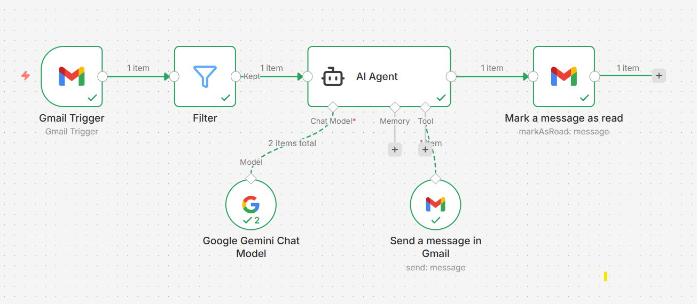

# 🤖 AI Email Auto Responder (Gmail + AI Agent)

An automated email reply system powered by AI that reads incoming Gmail messages and sends intelligent replies instantly.

## 🚀 Workflow Overview

This project uses an AI Agent integrated with Gmail to:

1. Trigger on new incoming emails
2. Filter relevant messages
3. Generate smart replies using AI (Google Gemini / LLM)
4. Automatically send reply
5. Mark email as read

## 🧠 Architecture

Gmail Trigger → Filter → AI Agent → Send Reply → Mark as Read

## 🛠️ Tech Stack

- Gmail API
- AI Agent (LLM - Google Gemini)
- Automation Platform (Make / n8n / Zapier style)
- Prompt Engineering

## ⚙️ Features

- ✅ Automatic email replies
- ✅ Context-aware AI responses
- ✅ Multi-language support
- ✅ Business-ready tone generation
- ✅ Spam/irrelevant filtering
- ✅ Fully automated workflow

## 📸 Workflow Screenshot

## 🧩 AI Prompt Logic

The AI agent:
- Understands email intent
- Detects tone
- Generates professional replies
- Keeps responses short & relevant

## 📦 Use Cases

- Customer Support Automation
- Business Inquiry Handling
- Personal Email Assistant
- Freelancers / Agencies
- SaaS Support Systems

## 🔒 Notes

- Customize prompt for your business tone
- Add safety filters for critical emails
- Avoid auto-reply for sensitive conversations

## 💡 Future Improvements

- Smart priority detection
- CRM integration
- Auto-labeling emails
- Analytics dashboard

## 🙌 Contributing

Feel free to fork and improve this project!

---

Made with n8n using AI Automation
